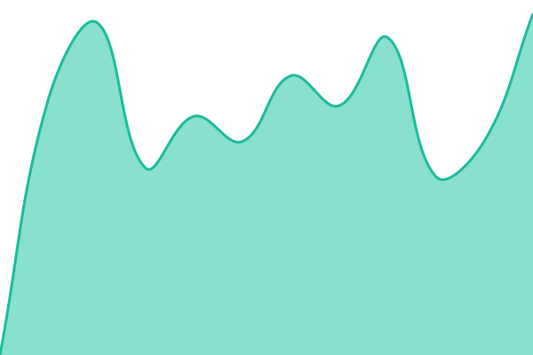
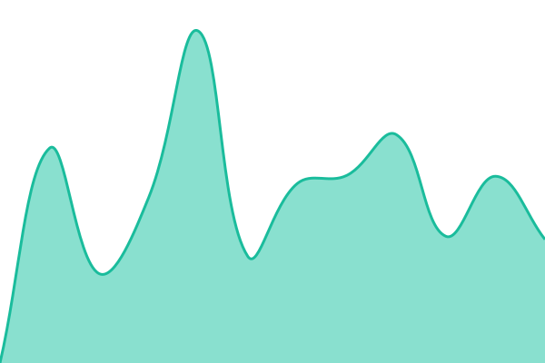

# [📈 Live Status](https://webrandbe.github.io/upptime): <!--live status--> **🟥 Complete outage**

This repository contains the open-source uptime monitor and status page for [WEBRAND](https://webrandbe.github.io/upptime), powered by [Upptime](https://github.com/upptime/upptime).

With [Upptime](https://upptime.js.org), you can get your own unlimited and free uptime monitor and status page, powered entirely by a GitHub repository. We use [Issues](https://github.com/webrandbe/upptime/issues) as incident reports, [Actions](https://github.com/webrandbe/upptime/actions) as uptime monitors, and [Pages](https://webrandbe.github.io/upptime) for the status page.

<!--start: status pages-->
<!-- This summary is generated by Upptime (https://github.com/upptime/upptime) -->
<!-- Do not edit this manually, your changes will be overwritten -->
<!-- prettier-ignore -->
| URL | Status | History | Response Time | Uptime |
| --- | ------ | ------- | ------------- | ------ |
|  [IT1](https://www.it1.be) | 🟥 Down | [it-1.yml](https://github.com/webrandbe/upptime/commits/HEAD/history/it-1.yml) | 

 3833ms
     
 | 

<a href="https://webrandbe.github.io/upptime/history/it-1">98.86%</a>
    

|  [WEBRAND](https://www.webrand.be) | 🟥 Down | [webrand.yml](https://github.com/webrandbe/upptime/commits/HEAD/history/webrand.yml) | 

 1105ms
     
 | 

<a href="https://webrandbe.github.io/upptime/history/webrand">99.15%</a>
    

|  [Mijn Groeiplan](https://mijngroeiplan.be/) | 🟥 Down | [mijn-groeiplan.yml](https://github.com/webrandbe/upptime/commits/HEAD/history/mijn-groeiplan.yml) | 

 1124ms
     
 | 

<a href="https://webrandbe.github.io/upptime/history/mijn-groeiplan">99.44%</a>
    

|  [Mijn Groeiplan App](https://dashboard.mijngroeiplan.be/) | 🟥 Down | [mijn-groeiplan-app.yml](https://github.com/webrandbe/upptime/commits/HEAD/history/mijn-groeiplan-app.yml) | 

 1928ms
     
 | 

<a href="https://webrandbe.github.io/upptime/history/mijn-groeiplan-app">99.72%</a>
    

<!--end: status pages-->

[**Visit our status website →**](https://webrandbe.github.io/upptime)

## 📄 License

- Powered by: [Upptime](https://github.com/upptime/upptime)
- Code: [MIT](./LICENSE) © [Anand Chowdhary](https://anandchowdhary.com), supported by [Pabio](https://pabio.com)
- Data in the `./history` directory: [Open Database License](https://opendatacommons.org/licenses/odbl/1-0/)
